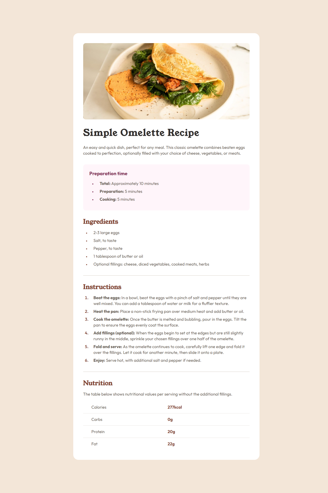
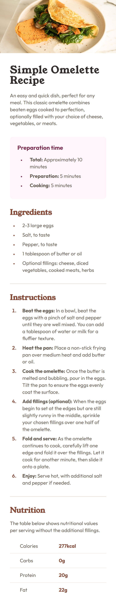

# Frontend Mentor - Recipe page solution

This is a solution to the [Recipe page challenge on Frontend Mentor](https://www.frontendmentor.io/challenges/recipe-page-KiTsR8QQKm).

## Table of contents

- [Overview](#overview)
  - [The challenge](#the-challenge)
  - [Screenshot](#screenshot)
  - [Links](#links)
- [My process](#my-process)
  - [Built with](#built-with)
  - [What I learned](#what-i-learned)
- [Author](#author)

## Overview

### The challenge

- Create a recipe page that shows the preparation time, ingredients, instructions and nutrition of the meal.
- The solution should look as similar as possible to the design (screenshot in the design folder).
- Make a responsive design for mobile and desktop view.

### Screenshot

#### Desktop view



#### Mobile view



### Links

- Solution URL: [Code](https://github.com/hellcsaba/recipe-page)
- Live Site URL: [Recipe page live](https://hellcsaba.github.io/recipe-page/)

## My process

### Built with

- Semantic HTML5 markup
- CSS custom properties, pseudo-classes, pseudo-elements
- Flexbox
- Desktop-first workflow
- Google Fonts

### What I learned

I learnt how to use ::marker pseudo-element for styling list items and :not, :last-child pseudo-classes. During the development I gained experience using tables and customizing their style. At the end it was inconvinient to meet the requirements of responsiveness for mobile view because of the image of the recipe. (Probably in my next project I will work with mobile-first workflow.)

```css
.nutrition-table tr:not(:last-child) {
  border-bottom: 1px solid var(--stone-150);
}

.nutrition-table td:nth-child(even) {
  color: var(--brown-800);
  font-weight: 700;
  padding-right: 2rem;
}

.nutrition-table td:nth-child(odd) {
  padding-left: 2rem;
}
```

## Author

- Website - [Csaba Hell](https://github.com/hellcsaba)
- Frontend Mentor - [@hellcsaba](https://www.frontendmentor.io/profile/hellcsaba)
- LinkedIn - [@csabahell](https://www.linkedin.com/in/csabahell/)
